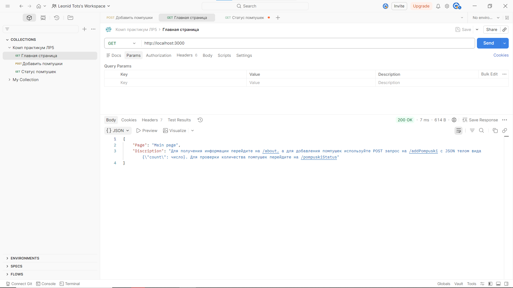
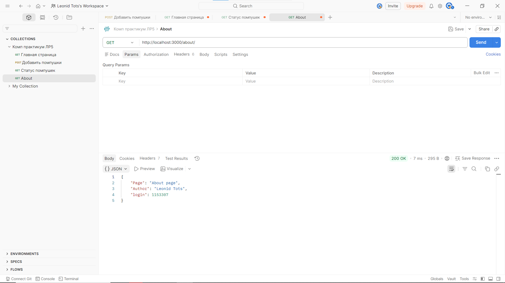
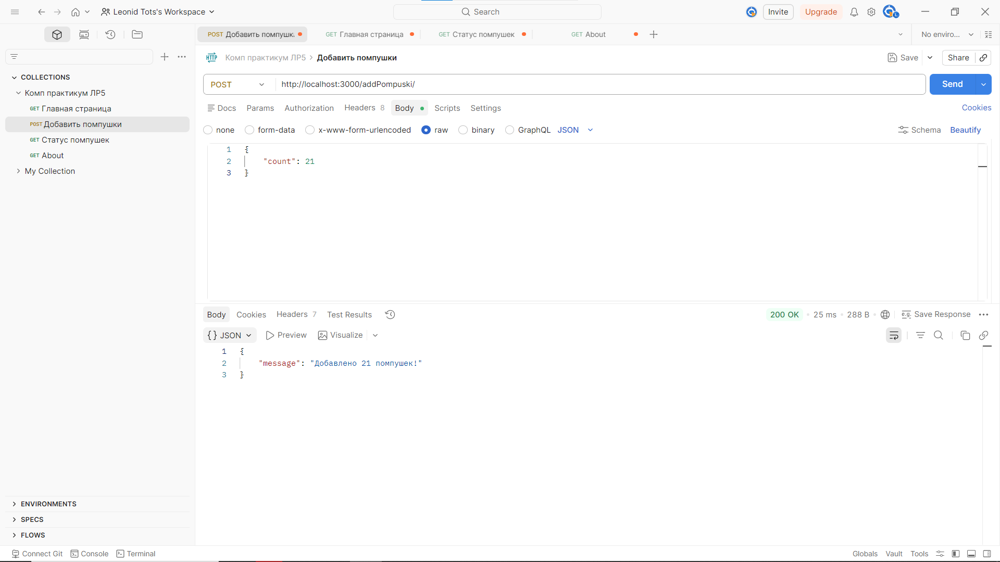
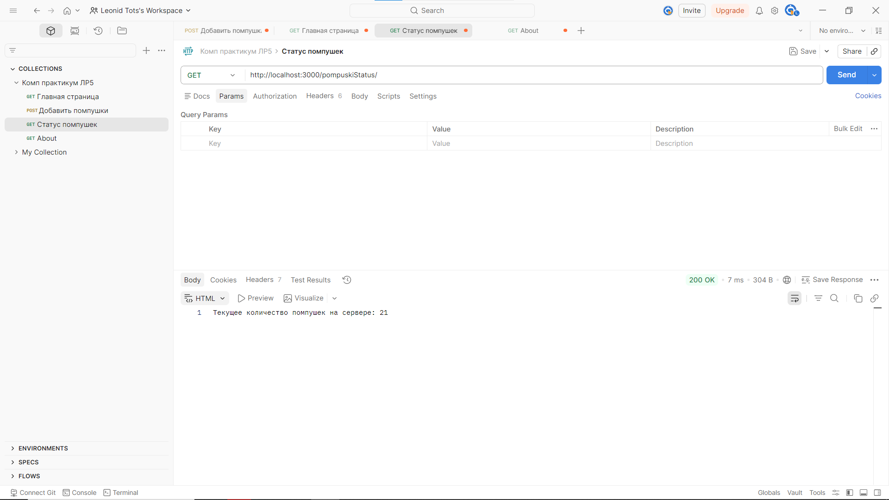
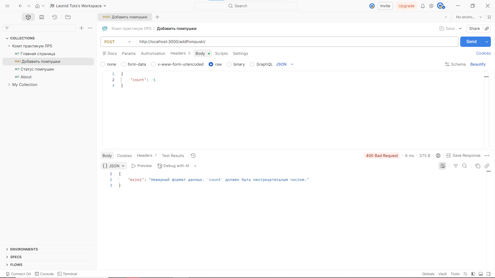
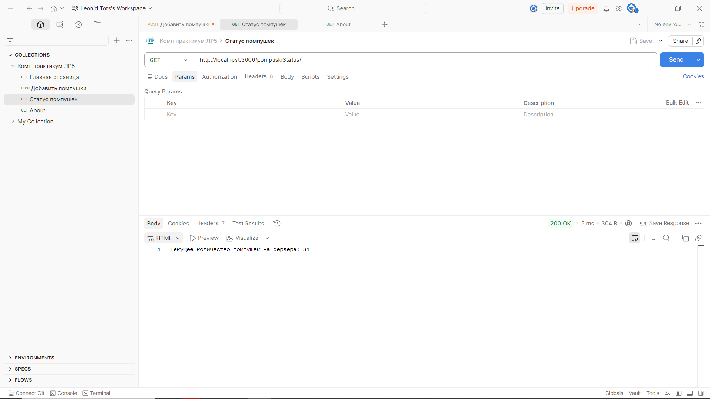

# ОТЧЁТ
## по лабораторной работе №5

---

## 1. ОПИСАНИЕ ИНСТРУМЕНТАРИЯ

### 1.1. Используемые технологии

**Node.js** — среда выполнения JavaScript на стороне сервера. Позволяет выполнять JavaScript-код вне браузера, создавать сетевые приложения и работать с файловой системой.

**Express.js** — минималистичный веб-фреймворк для Node.js. Предоставляет удобный API для создания веб-серверов, обработки маршрутов (routing) и работы с HTTP-запросами/ответами.

**npm (Node Package Manager)** — менеджер пакетов для Node.js. Используется для установки зависимостей (Express) и управления проектом.

### 1.2. Инструменты тестирования

Для демонстрации работы приложения могут быть использованы:
- **Веб-браузер** — для отправки GET-запросов
- **cURL** — утилита командной строки для работы с URL
- **Postman/Insomnia** — графические клиенты для тестирования API
- **Консоль браузера** — для отправки fetch-запросов

---

## 2. КОД ВЕБ-ПРИЛОЖЕНИЯ

### 2.1. Файл app.js

```javascript
const express = require('express')

// Пытаемся взять порт и хост из настроек системы
const PORT = process.env.PORT || 3000;
const HOST = process.env.HOST || 'localhost';
const app = express()

// Подключаем middleware (промежуточное ПО) для автоматического чтения JSON
app.use(express.json())

// Переменная для хранения количества помпушек
let pompuski = 0

// Регистрируем обработчик для корневого маршрута
app.get('/', (req, res) => {
    res.status(200).json({
        "Page": "Main page", 
        "Discription": "Для получения информации перейдите на /about, а для добавления помпушек используйте POST запрос на /addPompuski с JSON телом вида {\"count\": число}. Для проверки количества помпушек перейдите на /pompuskiStatus"
    })
})

app.get('/about', (req, res) => {
    res.status(200).json(
        {"Page": "About page", "Author": "Leonid Tots", "login": 1153307}
    )
})

app.post('/addPompuski', (req, res) => {
    const count = req.body.count
    if (typeof count === 'number' && count >= 0) {
        pompuski += count
        res.status(200).json({"message": `Добавлено ${count} помпушек!`})
    } else {
        res.status(400).json({"error": "Неверный формат данных. 'count' должен быть неотрицательным числом."})
    }
})

app.get('/pompuskiStatus', (req, res) => {
    res.status(200).send(`Текущее количество помпушек на сервере: ${pompuski}`)
})

app.listen(PORT, HOST, () => {
  console.log(`Сервер запущен на http://${HOST}:${PORT}`);
});
```

### 2.2. Файл package.json

```json
{
  "name": "lab5",
  "version": "1.0.0",
  "description": "RSPU",
  "license": "ISC",
  "author": "Leonid",
  "type": "commonjs",
  "main": "app.js",
  "scripts": {
    "test": "echo \"Error: no test specified\" && exit 1",
    "start": "node app.js",
    "dev": "nodemon app.js"
  },
  "dependencies": {
    "express": "^5.2.1"
  },
  "devDependencies": {},
  "keywords": []
}
```

### 2.3. Описание маршрутов

| Метод | Маршрут | Описание |
|-------|---------|----------|
| GET | / | Главная страница с описанием API |
| GET | /about | Информация об авторе |
| POST | /addPompuski | Добавление количества помпушек |
| GET | /pompuskiStatus | Получение текущего количества помпушек |

---

## 3. ИНСТРУКЦИЯ ПО ЗАПУСКУ

### 3.1. Установка зависимостей

```bash
npm install
```

### 3.2. Запуск сервера

**Обычный запуск:**
```bash
node app.js
```

**С автоматической перезагрузкой (требуется nodemon):**
```bash
npm run dev
```

### 3.3. Ожидаемый вывод в консоли

```
Сервер запущен на http://localhost:3000
```

---

## 4. ДЕМОНСТРАЦИЯ РАБОТЫ ПРИЛОЖЕНИЯ

### 4.1. GET-запрос на корневой маршрут (/)

**Способ выполнения:** Отправить запрос в Postman `http://localhost:3000/`

**Ожидаемый ответ:**
```json
{
  "Page": "Main page",
  "Discription": "Для получения информации перейдите на /about, а для добавления помпушек используйте POST запрос на /addPompuski с JSON телом вида {\"count\": число}. Для проверки количества помпушек перейдите на /pompuskiStatus"
}
```



---

### 4.2. GET-запрос на /about

**Способ выполнения:** Отправить запрос в Postman `http://localhost:3000/about`

**Ожидаемый ответ:**
```json
{
  "Page": "About page",
  "Author": "Leonid Tots",
  "login": 1153307
}
```



---

### 4.3. POST-запрос на /addPompuski (успешный)

**Способ выполнения через Postman:**
1. Выбрать метод POST
2. Ввести URL: `http://localhost:3000/addPompuski/`
3. Перейти во вкладку Body
4. Выбрать raw и формат JSON
5. Ввести: `{"count": 5}`
6. Нажать Send

**Ожидаемый ответ:**
```json
{
  "message": "Добавлено 5 помпушек!"
}
```

**Код состояния:** 200 OK

Изначально помпушек 0


Добавляем 21 помпушку


Проверяем кол-во помпушек


Отлично, всё работает!

---

### 4.4. POST-запрос на /addPompuski (ошибочный)


**Ожидаемый ответ:**
```json
{
  "error": "Неверный формат данных. 'count' должен быть неотрицательным числом."
}
```

**Код состояния:** 400 Bad Request



---

### 4.5. GET-запрос на /pompuskiStatus

**Способ выполнения:** Открыть в браузере `http://localhost:3000/pompuskiStatus`

**Ожидаемый ответ:**
```
Текущее количество помпушек на сервере: 5
```

Добавил ещё 10 помпушек и проверил сколько их



---

## 5. ЗАКЛЮЧЕНИЕ

Веб-приложение разработано на платформе Node.js с использованием фреймворка Express.js. Приложение корректно обрабатывает GET и POST запросы, выполняет валидацию входных данных и возвращает соответствующие HTTP коды состояния. 

Основные функции приложения:
- Предоставление информации о API через корневой маршрут
- Отображение информации об авторе
- Добавление количества помпушек с валидацией данных
- Получение текущего количества помпушек

