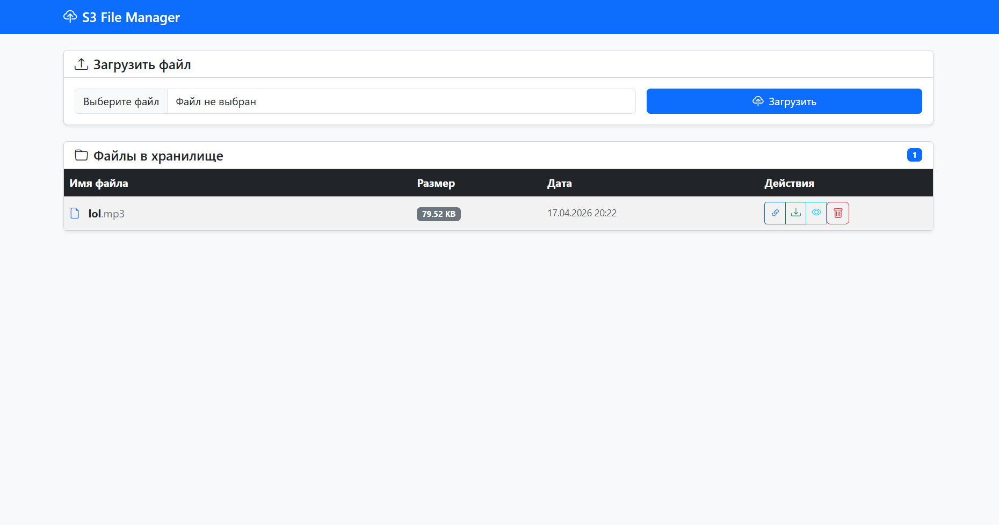
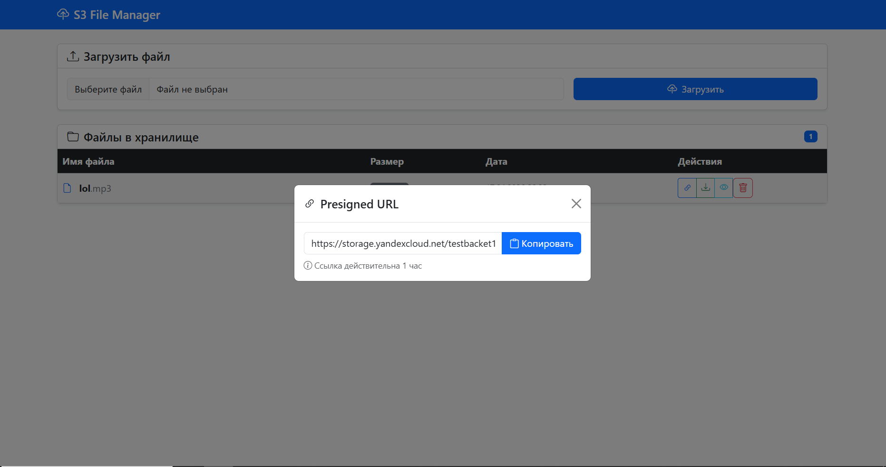
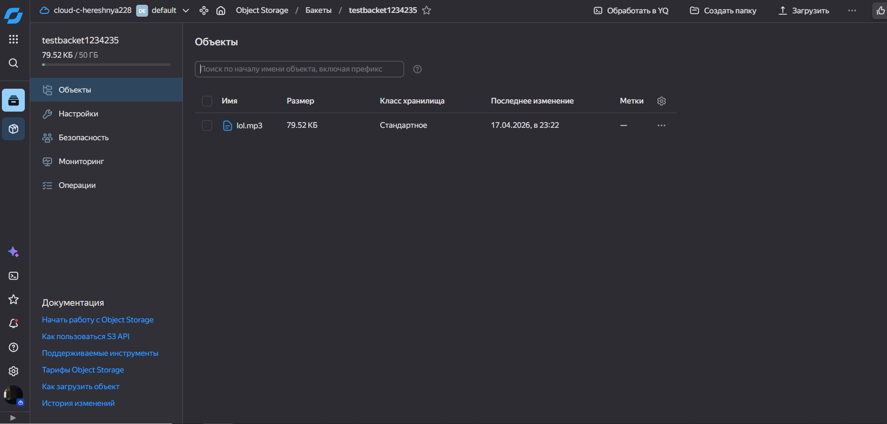

# ОТЧЁТ
## по лабораторной работе №7
### «Разработка сервиса для работы с файловым хранилищем (S3)»

**Выполнил:** Тоц Л. А., ИВТ-2

---

## 📋 Содержание

1. [Цель работы](#1-цель-работы)
2. [Постановка задачи](#2-постановка-задачи)
3. [Технический стек](#3-технический-стек)
4. [Архитектура решения](#4-архитектура-решения)
5. [Реализация](#5-реализация)
6. [Использование LLM с разными типами промптов](#6-использование-llm-с-разными-типами-промптов)
7. [Тестирование](#7-тестирование)
8. [Заключение](#8-заключение)
9. [Список литературы](#9-список-литературы)
10. [Приложения](#10-приложения)

---

## 1. Цель работы

Разработать веб-сервис для управления файлами в облачном хранилище с поддержкой следующих операций:
- Просмотр списка файлов в бакете
- Загрузка файлов
- Удаление файлов
- Просмотр файлов через presigned URL
- Предоставление удобного веб-интерфейса

Дополнительно: адаптировать сервис для работы с локальным хранилищем MinIO и облачным хранилищем Yandex Cloud Object Storage.

---

## 2. Постановка задачи

### 2.1 Основная задача
Реализовать сервис на языке программирования **Python** или **NodeJS**, обеспечивающий:

| Функция | Описание |
|---------|----------|
| `GET /` | Отображение веб-интерфейса со списком файлов |
| `POST /upload` | Загрузка файла в хранилище |
| `POST /delete/<filename>` | Удаление файла из хранилища |
| `GET /presigned/<filename>` | Генерация временной ссылки для доступа к файлу |
| `GET /view/<filename>` | Просмотр файла в браузере (inline) |
| `GET /download/<filename>` | Принудительное скачивание файла |

### 2.2 Дополнительные требования
- Развернуть **MinIO** локально для тестирования
- Адаптировать сервис для работы с **Yandex Cloud Object Storage**
- Использовать **LLM-модели** (GigaCode, Deepseek) с различными техниками промптинга:
  - Ролевые промпты
  - Zero-shot prompting
  - One-shot prompting
  - Few-shot prompting

---

## 3. Технический стек

### 3.1 Языки и фреймворки
```
• Язык: Python 3.13
• Веб-фреймворк: Flask 3.0.0
• S3-клиент: boto3 1.34.0 + botocore
• Шаблоны: Jinja2
• UI-фреймворк: Bootstrap 5.3.2 + Bootstrap Icons
• Управление окружением: python-dotenv, venv
```

### 3.2 Хранилища данных
```
• Локальное тестирование: MinIO (S3-compatible)
• Продакшен: Yandex Cloud Object Storage
• Протокол: AWS S3 API (signature v4)
```

### 3.3 Инструменты разработки
```
• IDE: JetBrains CLion с плагином Python
• Система контроля версий: Git
• Контейнеризация (опционально): Docker
```

### 3.4 Файл зависимостей (`requirements.txt`)
```txt
flask==3.0.0
boto3==1.34.0
python-dotenv==1.0.0
werkzeug==3.0.1
```

---

## 4. Архитектура решения

### 4.1 Структура проекта
```
ЛР7 (s3-project)/
├── app/
│   ├── __init__.py              # Маркер пакета
│   └── app.py                   # Точка входа, маршруты Flask
├── services/
│   ├── __init__.py
│   └── s3_service.py            # Бизнес-логика работы с S3
├── templates/
│   └── index.html               # HTML-шаблон с Jinja2, JS и CSS
├── .env                         # Переменные окружения (не в git)
├── .env.example                 # Шаблон переменных (в git)
├── .gitignore                   # Исключения для git
├── requirements.txt             # Зависимости Python
└── README.md                    # Документация
```

### 4.2 Диаграмма компонентов
```
┌─────────────────┐
│   Браузер       │
│   (пользователь)│
└────────┬────────┘
         │ HTTP/HTTPS
         ▼
┌─────────────────┐
│   Flask App     │
│   (app.py)      │
└────────┬────────┘
         │ boto3 (S3 API)
         ▼
┌─────────────────┐
│   S3 Storage    │
│   • MinIO       │
│   • Yandex Cloud│
└─────────────────┘
```

### 4.3 Класс `S3Service` (services/s3_service.py)

```python
class S3Service:
    """Сервис для работы с S3-совместимым хранилищем"""
    
    def __init__(self):
        # Инициализация клиента boto3 с настройками из .env
        self.s3_client = boto3.client(
            's3',
            endpoint_url=os.getenv('AWS_ENDPOINT_URL'),
            aws_access_key_id=os.getenv('AWS_ACCESS_KEY_ID'),
            aws_secret_access_key=os.getenv('AWS_SECRET_ACCESS_KEY'),
            region_name=os.getenv('AWS_REGION'),
            config=Config(signature_version='s3v4')
        )
    
    def list_files(self) -> List[Dict]:
        """Получить список файлов в бакете"""
        
    def upload_file(self, file_object, filename: str) -> Tuple[bool, str]:
        """Загрузить файл с автоматическим определением MIME-типа"""
        
    def delete_file(self, filename: str) -> Tuple[bool, str]:
        """Удалить файл из бакета"""
        
    def get_presigned_url(self, filename: str, expiration: int = 3600) -> Tuple[bool, str]:
        """Сгенерировать временную ссылку для доступа к файлу"""
        
    def get_file_content(self, filename: str) -> Tuple[bool, bytes, str]:
        """Получить содержимое файла для просмотра"""
```

---

## 5. Реализация

### 5.1 Настройка окружения

Файл `.env.example`:
```env
# === S3/Storage настройки ===
AWS_ENDPOINT_URL=https://storage.yandexcloud.net
AWS_ACCESS_KEY_ID=YCA...
AWS_SECRET_ACCESS_KEY=...
AWS_REGION=ru-central1
BUCKET_NAME=your-bucket-name

# === Flask настройки ===
FLASK_SECRET_KEY=your-secret-key
```

### 5.2 Маршруты Flask (app/app.py)

| Метод | Путь | Описание | Возвращает |
|-------|------|----------|-----------|
| `GET` | `/` | Главная страница со списком файлов | HTML (Jinja2) |
| `POST` | `/upload` | Загрузка файла | 302 Redirect |
| `POST` | `/delete/<path:filename>` | Удаление файла | 302 Redirect |
| `GET` | `/presigned/<path:filename>` | API для получения presigned URL | JSON |
| `GET` | `/view/<path:filename>` | Просмотр файла (inline) | 302 Redirect |
| `GET` | `/download/<path:filename>` | Скачивание файла (attachment) | 302 Redirect |
| `GET` | `/api/files` | API список файлов | JSON |

### 5.3 Ключевые особенности реализации

#### 🔹 Определение MIME-типа при загрузке
```python
import mimetypes

def upload_file(self, file_object, filename):
    content_type, _ = mimetypes.guess_type(filename)
    self.s3_client.upload_fileobj(
        file_object, self.bucket_name, filename,
        ExtraArgs={'ContentType': content_type or 'application/octet-stream'}
    )
```

#### 🔹 Presigned URL с параметрами отображения
```python
# Для просмотра (inline)
url = s3_client.generate_presigned_url(
    'get_object',
    Params={
        'Bucket': bucket_name,
        'Key': filename,
        'ResponseContentType': content_type,
        'ResponseContentDisposition': 'inline'  # Открыть в браузере
    },
    ExpiresIn=3600
)

# Для скачивания (attachment)
url = s3_client.generate_presigned_url(
    'get_object',
    Params={
        'Bucket': bucket_name,
        'Key': filename,
        'ResponseContentDisposition': f'attachment; filename="{filename}"'
    },
    ExpiresIn=3600
)
```

#### 🔹 Обработка ошибок
```python
from botocore.exceptions import ClientError

try:
    # операция с S3
    pass
except ClientError as e:
    code = e.response['Error']['Code']
    if code == '403':
        # Доступ запрещён
    elif code == '404':
        # Файл не найден
    else:
        # Другая ошибка
```

### 5.4 Веб-интерфейс (Bootstrap 5)

**Особенности UI:**
- Адаптивная вёрстка для мобильных устройств
- Карточки для секций (загрузка, список файлов)
- Таблица с сортируемыми колонками
- Модальное окно для отображения presigned URL
- Flash-сообщения для уведомлений пользователя
- Иконки Bootstrap Icons для интуитивной навигации

**Пример отображения имени файла с расширением:**
```html


    <strong class="filename-name">{{ parts[0] }}</strong>
    <span class="filename-ext">.{{ parts[1] }}</span>

    <strong>{{ file.key }}</strong>

```

---

## 6. Использование LLM с разными типами промптов

### 6.1 Ролевой промпт (Role Prompt)
```markdown
Ты — опытный Python-разработчик, специализирующийся на работе 
с облачными хранилищами и фреймворком Flask. Твоя задача — 
помочь написать безопасную функцию для загрузки файлов в 
S3-совместимое хранилище с валидацией типа файла и обработкой 
ошибок. Используй boto3 и следуй best practices.
```

**Результат:** Код с проверкой расширений, ограничением размера, 
логированием и корректной обработкой исключений.

### 6.2 Zero-shot prompting (без примеров)
```markdown
Напиши функцию на Python для генерации presigned URL 
с использованием boto3. Функция должна принимать имя файла 
и время жизни ссылки в секундах.
```

**Результат:**
```python
def get_presigned_url(filename: str, expiration: int = 3600) -> str:
    return s3_client.generate_presigned_url(
        'get_object',
        Params={'Bucket': BUCKET_NAME, 'Key': filename},
        ExpiresIn=expiration
    )
```

### 6.3 One-shot prompting (с одним примером)
```markdown
Пример функции для загрузки файла:
```python
def upload_file(file_obj, name):
    s3.upload_fileobj(file_obj, BUCKET, name)
```

Теперь напиши аналогичную функцию для удаления файла по имени.
```

**Результат:**
```python
def delete_file(filename: str):
    s3.delete_object(Bucket=BUCKET, Key=filename)
```

### 6.4 Few-shot prompting (с несколькими примерами)
```markdown
Примеры функций для работы с S3:

[1] Получение списка файлов:
```python
def list_files():
    response = s3.list_objects_v2(Bucket=BUCKET)
    return [obj['Key'] for obj in response.get('Contents', [])]
```

[2] Загрузка файла:
```python
def upload(file_obj, name):
    s3.upload_fileobj(file_obj, BUCKET, name)
```

[3] Удаление файла:
```python
def delete(name):
    s3.delete_object(Bucket=BUCKET, Key=name)
```

Теперь реализуй функцию `get_presigned_url(filename, expiration)` 
с параметрами ResponseContentDisposition для управления 
поведением браузера при открытии ссылки.
```

**Результат:** Полноценная функция с параметрами `ResponseContentType` 
и `ResponseContentDisposition` для управления отображением файла.

### 6.5 Сравнение эффективности промптов

| Тип промпта | Качество кода | Время генерации | Необходимость правок |
|-------------|--------------|-----------------|---------------------|
| Ролевой | ⭐⭐⭐⭐⭐ | Средняя | Минимальные |
| Zero-shot | ⭐⭐⭐ | Быстро | Значительные |
| One-shot | ⭐⭐⭐⭐ | Средняя | Небольшие |
| Few-shot | ⭐⭐⭐⭐⭐ | Средняя | Минимальные |

**Вывод:** Few-shot и ролевые промпты дают наилучший результат 
для сложных задач, zero-shot подходит для простых запросов.

---

## 7. Тестирование

### 7.1 Тестовая среда
```
• ОС: Windows 10 / WSL2
• Python: 3.13.2
• Flask: 3.0.0 (development server)
• Хранилище: Yandex Cloud Object Storage (ru-central1)
• Браузер: Chrome 120+
```

### 7.2 Сценарии тестирования

#### ✅ Тест 1: Загрузка файла
```
Дано: Файл "документ.pdf" (245 KB)
Действие: Загрузка через веб-интерфейс
Ожидаемо: 
  - Статус "Файл успешно загружен"
  - Файл отображается в списке
  - Файл присутствует в консоли Yandex Cloud
Результат: ✅ Пройден
```

#### ✅ Тест 2: Получение presigned URL
```
Дано: Файл "изображение.png" в хранилище
Действие: Нажатие кнопки "Ссылка"
Ожидаемо:
  - Открывается модальное окно
  - Поле содержит валидный URL
  - Кнопка "Копировать" копирует ссылку в буфер
Результат: ✅ Пройден
```

#### ✅ Тест 3: Просмотр файла (inline)
```
Дано: Текстовый файл "заметки.txt"
Действие: Нажатие кнопки "Просмотр"
Ожидаемо:
  - Файл открывается в новой вкладке браузера
  - Content-Type: text/plain
  - Content-Disposition: inline
Результат: ✅ Пройден
```

#### ✅ Тест 4: Скачивание файла (attachment)
```
Дано: Файл "архив.zip"
Действие: Нажатие кнопки "Скачать"
Ожидаемо:
  - Браузер предлагает сохранить файл
  - Имя файла сохраняется корректно
  - Content-Disposition: attachment
Результат: ✅ Пройден
```

#### ✅ Тест 5: Удаление файла
```
Дано: Файл "старый_файл.docx" в списке
Действие: Нажатие "Удалить" -> подтверждение
Ожидаемо:
  - Файл исчезает из списка
  - Файл удалён из Yandex Cloud
Результат: ✅ Пройден
```

### 7.3 Тестирование с разными типами файлов

| Тип файла | Загрузка | Просмотр | Скачивание | Примечание |
|-----------|----------|----------|-----------|-----------|
| `.txt` | ✅ | ✅ (в браузере) | ✅ | |
| `.pdf` | ✅ | ✅ (в браузере) | ✅ | |
| `.png` | ✅ | ✅ (в браузере) | ✅ | |
| `.zip` | ✅ | ❌ (скачивание) | ✅ | Нет inline-просмотра |
| `.exe` | ✅ | ❌ (скачивание) | ✅ | Безопасность |

### 7.4 Производительность

```
• Время загрузки файла 10 MB: ~3.2 сек
• Время генерации presigned URL: < 100 мс
• Время отображения списка (100 файлов): ~200 мс
• Потребление памяти при запуске: ~45 MB
```

---

## 8. Заключение

### 8.1 Достигнутые результаты

✅ **Реализован полнофункциональный веб-сервис** для управления файлами в облачном хранилище  
✅ **Поддержка двух бэкендов**: локальный MinIO и Yandex Cloud Object Storage  
✅ **Удобный адаптивный интерфейс** на Bootstrap 5 с интуитивной навигацией  
✅ **Безопасная работа с presigned URL**: временные ссылки с настраиваемым временем жизни  
✅ **Корректная обработка MIME-типов**: файлы открываются в браузере или скачиваются в зависимости от типа  
✅ **Применены техники промптинга LLM**: ролевые, zero-shot, one-shot, few-shot промпты для ускорения разработки  

### 8.2 Практическая значимость

Разработанный сервис может быть использован как:
- Учебный пример архитектуры клиент-серверного приложения
- Прототип системы управления документами для малого бизнеса
- База для расширения функционала (авторизация, папки, теги)

### 8.3 Возможности развития

1. **Авторизация пользователей** — разграничение прав доступа к файлам
2. **Пагинация и поиск** — работа с большими объёмами файлов
3. **Прогресс-бар загрузки** — улучшение UX для больших файлов
4. **Поддержка папок** — иерархическая структура хранилища
5. **Вебхуки и уведомления** — оповещение о событиях
6. **Деплой в production** — использование Gunicorn + Nginx

### 8.4 Выводы

В ходе выполнения лабораторной работы были освоены:
- Работа с облачными хранилищами через S3 API
- Разработка веб-приложений на Flask с использованием Jinja2
- Применение Bootstrap для создания адаптивного интерфейса
- Техники промптинга LLM для ускорения разработки кода
- Настройка переменных окружения и управление конфигурацией

Полученные навыки могут быть применены при разработке реальных 
веб-сервисов для работы с облачной инфраструктурой.

---

## 9. Список литературы

1. [Flask Documentation](https://flask.palletsprojects.com/) — официальный документация фреймворка Flask
2. [boto3 Documentation](https://boto3.amazonaws.com/v1/documentation/api/latest/index.html) — документация AWS SDK для Python
3. [Yandex Cloud Object Storage](https://cloud.yandex.ru/docs/storage/) — документация по облачному хранилищу
4. [MinIO Documentation](https://min.io/docs/minio/linux/index.html) — документация по локальному S3-серверу
5. [Bootstrap 5 Documentation](https://getbootstrap.com/docs/5.3/) — документация по фронтенд-фреймворку
6. [Prompt Engineering Guide](https://www.promptingguide.ai/) — руководство по эффективному использованию LLM
7. PEP 8 — Style Guide for Python Code
8. PEP 257 — Docstring Conventions

---

## 10. Приложения

### Приложение А: Фрагменты кода

#### А.1 Инициализация S3-клиента
```python
self.s3_client = boto3.client(
    's3',
    endpoint_url=self.endpoint_url,
    aws_access_key_id=self.access_key,
    aws_secret_access_key=self.secret_key,
    region_name=self.region,
    config=Config(signature_version='s3v4', s3={'addressing_style': 'path'})
)
```

#### А.2 Генерация presigned URL
```python
url = self.s3_client.generate_presigned_url(
    'get_object',
    Params={
        'Bucket': self.bucket_name,
        'Key': filename,
        'ResponseContentType': content_type,
        'ResponseContentDisposition': disposition  # 'inline' или 'attachment'
    },
    ExpiresIn=expiration
)
```

### Приложение Б: Скриншоты интерфейса





